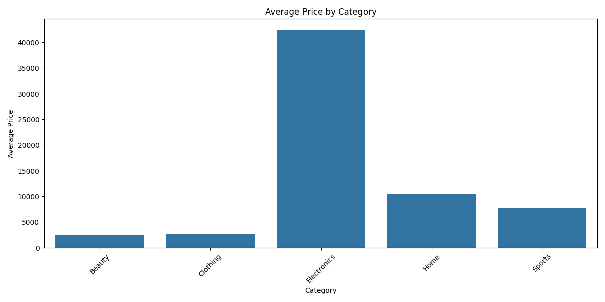

# Amazon E-Commerce Data Analysis

## Project Structure

analysis.py  
Python script used to clean, analyze, and aggregate the dataset using pandas.

queries.sql  
SQL queries used to replicate key analysis using SQL.

amazon_ecommerce.csv  
Dataset containing product information, ratings, pricing, and seller data.

average_price_by_category.png  
Visualization comparing average prices across product categories.

## Project Overview

This project analyzes a large Amazon e-commerce dataset to understand product distribution, pricing trends, and top-performing products across different categories. The analysis was performed using Python (Pandas) and SQL.

The goal of the project is to demonstrate basic data analysis techniques such as grouping, aggregation, sorting, and identifying insights from a large dataset.

Dataset source: Kaggle Amazon E-Commerce Dataset

---

## Tools Used

- Python
- Pandas
- SQL (SQLite)
- VS Code

---

## Dataset

The dataset contains approximately 1 million rows of simulated Amazon e-commerce transactions including:

- product_id
- category
- brand
- price
- discount
- final_price
- rating
- review_count
- seller information
- purchase date
- shipping time

---

## Analysis Performed

### 1. Product Distribution by Category

Identified how many products exist within each category.

Example insight:
- Product counts are relatively balanced across categories such as Electronics, Home, Sports, Clothing, and Beauty.

---

### 2. Average Price by Category

Calculated the average product price for each category.

Example insight:
- Electronics products have significantly higher average prices compared to other categories.

---

### 3. Top Performing Products by Category

Identified the top 5 products in each category based on:

- Highest average rating
- Highest number of reviews (used as a tie breaker)

This helps identify products that receive the strongest customer feedback.
`
---

## Visualization

### Average Price by Category

## Key Skills Demonstrated

- Data cleaning and exploration
- Aggregation and grouping with pandas
- Ranking products based on customer metrics
- SQL queries for category-level analysis
- Working with large datasets (~1M rows)

---

## Future Improvements

Possible improvements to the project include:

- Adding data visualizations
- Performing sales trend analysis over time
- Identifying high-return products
- Building dashboards using Power BI or Tableau